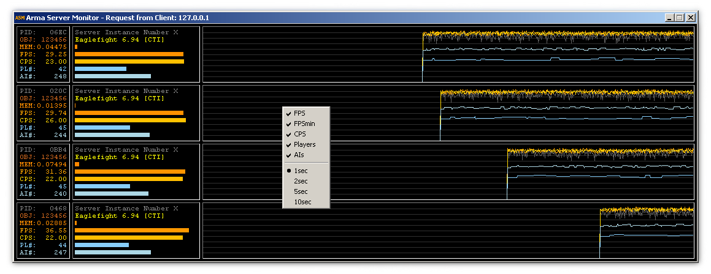

#Arma Server Monitor#

"Arma Server Monitor" is a spin-off of my experiments with the arma engine.

Propertys:

	- monitors up to 4 server (or headless client) instances simultaneous 
	- introduces a performance value CPS for FSM processing analysis
	- very simple, compact and solid design
	- almost no influence to cpu load
	- easy to use (mini addon)
	- customizable history graphs	

Currently able to monitor the following values:

	- PID process ID of the server instance
	- OBJ number of all objects in current mission (allMissionObjects)
	- MEM Amount of allocated physical memory
	- FPS (on a server this means simulation cycles per second)
	- FPSmin (the minimum FPS of the last 16 cycles, hist. graph only)
	- CPS Condition-evaluation per Second
	- PL# Number of alive player units
	- AI# Number of alive local AI units
	- Name of the currently played mission (missionName)
	- Name of the instance profile (profileName)

**Arma Server Monitor** consists of 3 components:

	fn_ASM.fsm 				- Collects and reports some internal performance states from arma server (or HC)
	ASMdll.dll 				- Interfaces to ArmaServerMonitor.exe via MMF (Memory Mapped File)
	ArmaServerMonitor.exe 	- The Monitor itself reads from MMF and displays the values

Alongside to the well known FPS (frames per second), an very interesting value **CPS** is introduced here.    
**CPS** is expressed by **condition** **evalations** per **second** and measured from an reference condition in `fn_ASM.fsm`.   

You can realize this **CPS** value as the reciprocal of the current "minimal response delay" of AI in the running mission.    

Two examples to illustrate the meaning of this value:   
Lets say we have an CPS value of 10.0 condition evaluations per second, then our AI has an minimal response delay of ca. 100ms here (1000ms/10.0). That means everything runs well in our first scenario.         
In a second scenario we have a value of 0.3 CPS, what means AI has a **minimal** response delay larger than 3 seconds !!!    
Especially COOP missions running with such low **CPS** are really no pleasure. AI seems to be "stupid".   

(If low CPS values occurs together with normal FPS values, I'd recommend to have a talk with the mission developer, because this behavior is very likely caused by **excessively** use of **execVM**, **spawn** etc.)    

Additional to the history graph of FPS values, now the value **FPSmin** is drawed as a graph.
By watching this graphs you can **easily spot lags** on your server, without being in game.

**How to use ASM:**

Extract this file: [https://github.com/fred41/ASM/blob/master/addon/ASM.zip](https://github.com/fred41/ASM/blob/master/addon/ASM.zip)    to your Arma 3 root folder.

Add -mod=@ASM to your server (or HC) launch params.     

Run `ArmaServerMonitor.exe` from what directory you want, to monitor all your server (or HC) instances locally.

(use right mouse button for popup menus)     

**Additional**, it is now possible to **connect** to `Arma Server Monitor` **from remote**.   
To do that, you need `ArmaServerMonitor.exe` on the remote device too and configure it per start params.   
Default start params for `ArmaServerMonitor.exe` are: `-server -n1 -h127.0.0.1 -p24000`   
This means, it starts per default as monitoring server and listens at TCP port 24000, max. allowed clients = 1.

Example for client configuration:   

    ArmaServerMonitor.exe -client -h201.178.1.102 -p24000

That means it starts as monitoring client and tries periodical to connect/read to/from your monitoring server at 201.178.1.102:24000.   
(If your server is firewall protected, you have to open TCP port on server)

**If you prefer to run your DS instance(s) as service, you have to start ArmaServerMonitor with admin rights**     

*ENJOY :)*     

Changelog:    
01.06.2013 Changed the install/launch method to **mini-addon** (thanks terox for inspiration)    
01.06.2013 Fixed: instance occupied additional slot at mission change    
02.06.2013 Changed bar graphs for CPS & FPS to **logarithmic scale** to show states more intuitive   
03.06.2013 Added **history graphs**, customizable (individual visibility, update interval), transparency switch    
05.06.2013 Finished ... or not ...  
08.06.2013 Custom build for use with for DS running as service added   
11.06.2013 Fixed: AI was not counted correctly    
13.06.2013 running DS as **service** now merged in default build (custom build removed)    
17.06.2013 **remote monitoring** now available via additional ASM instance, configured per start params      
18.06.2013 Amount of allocated physical memory in [GB], **MEM** added      
04.07.2013 graphs for player number adapted from 50 to 100    
05.07.2013 history graph extd., better lag visualisation via FPSmin (popup menu)     
09.07.2013 some performance related improvements          
11.07.2013 profilName now displayed additional to missionName; forced=1 -> preInit=1 in cfgFunctions      
15.07.2013 counter for allMissionObjects added, helps to check if cleanup routines works                  
